# **Pertemuan 3 : Pemrograman Berbasis Framework**

### Yonatan Efrassetyo / 24 / TI-3A

## Praktikum Langkah 1 

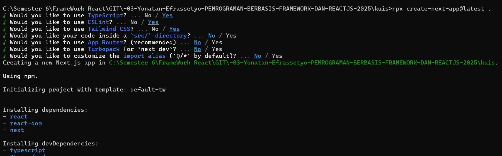

## Langkah 2

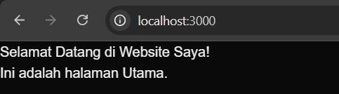

## Langkah 3

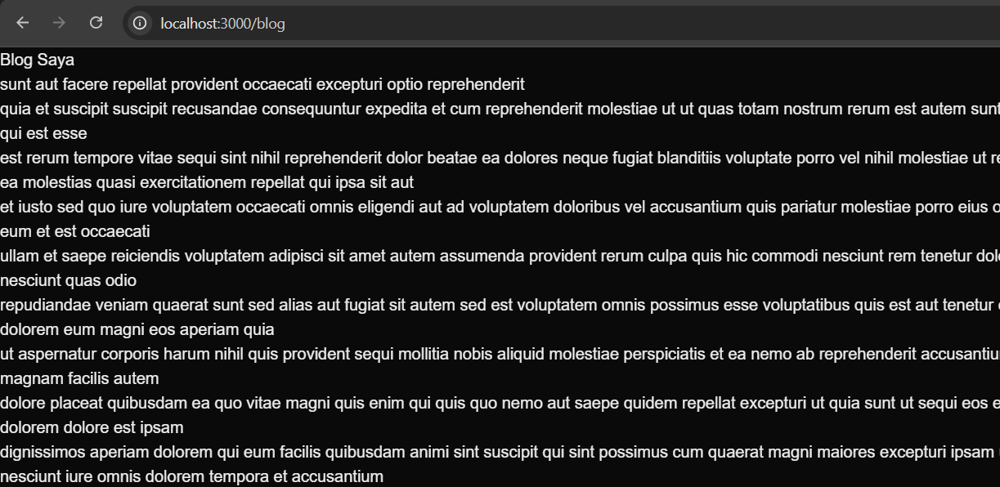

## Langkah 4 

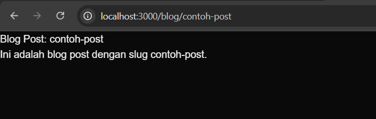

## Langkah 5 

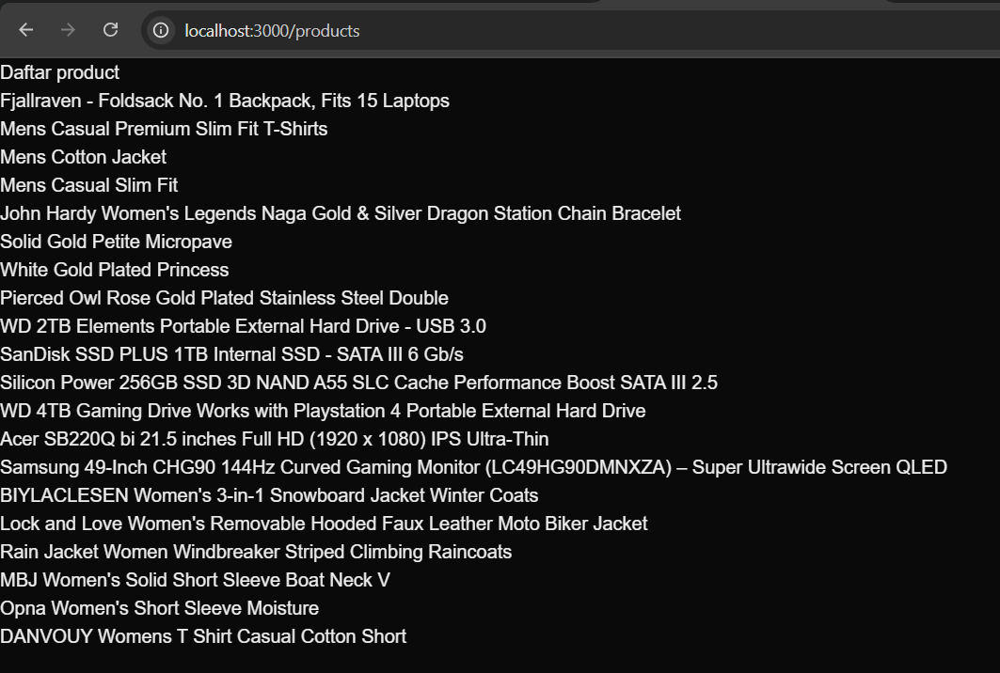

## Langkah 6

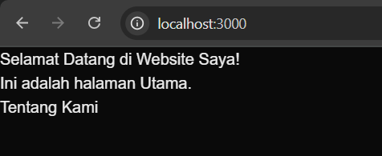

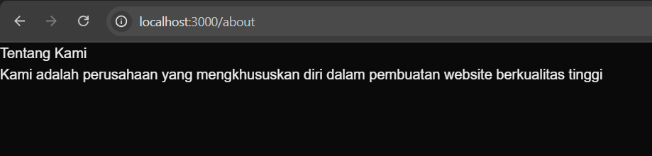

## Tugas 1 & 2

* Buat halaman baru dengan menggunakan Static Site Generation (SSG) yang menampilkan daftar 
pengguna dari API https://jsonplaceholder.typicode.com/users 
* Implementasikan Dynamic Routes untuk menampilkan detail pengguna berdasarkan ID. 

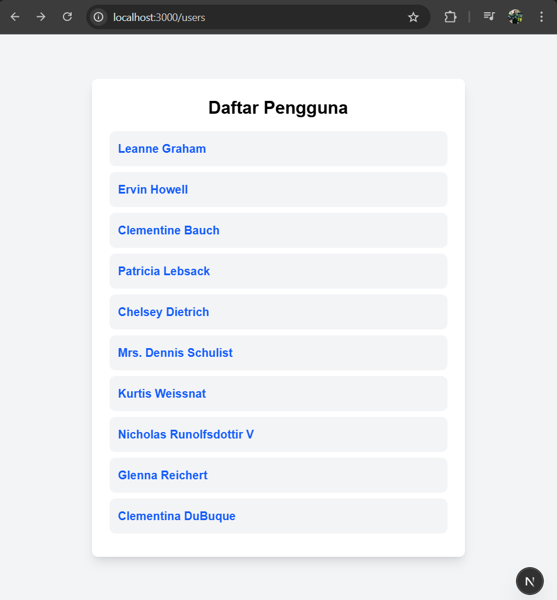

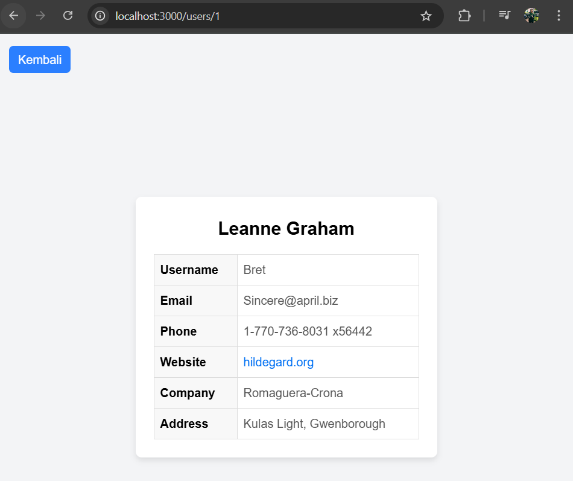

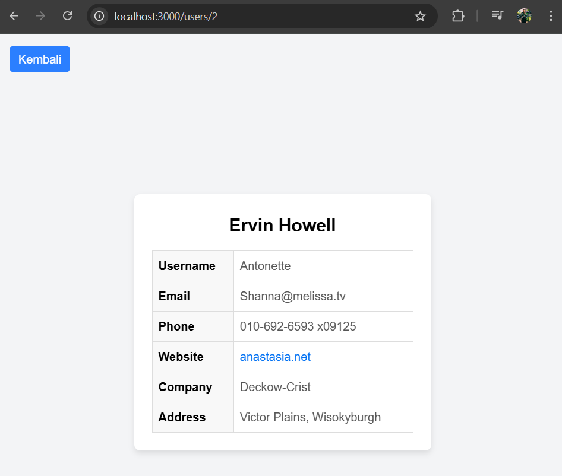

## Tugas 3
* Buat API route yang mengembalikan data cuaca dari API eksternal (misalnya, 
OpenWeatherMap) dan tampilkan data tersebut di halaman front-end. 

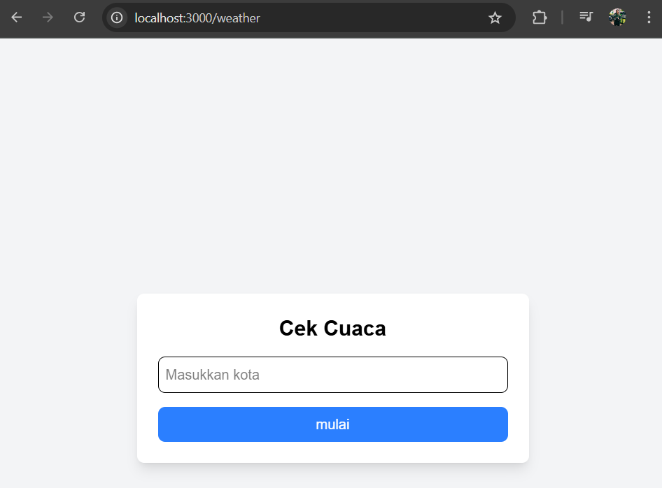

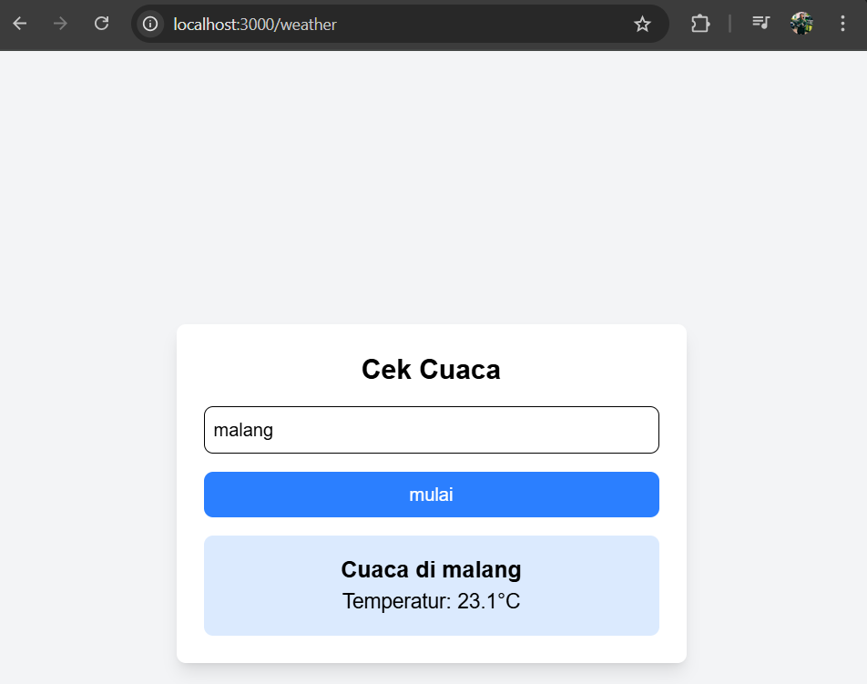

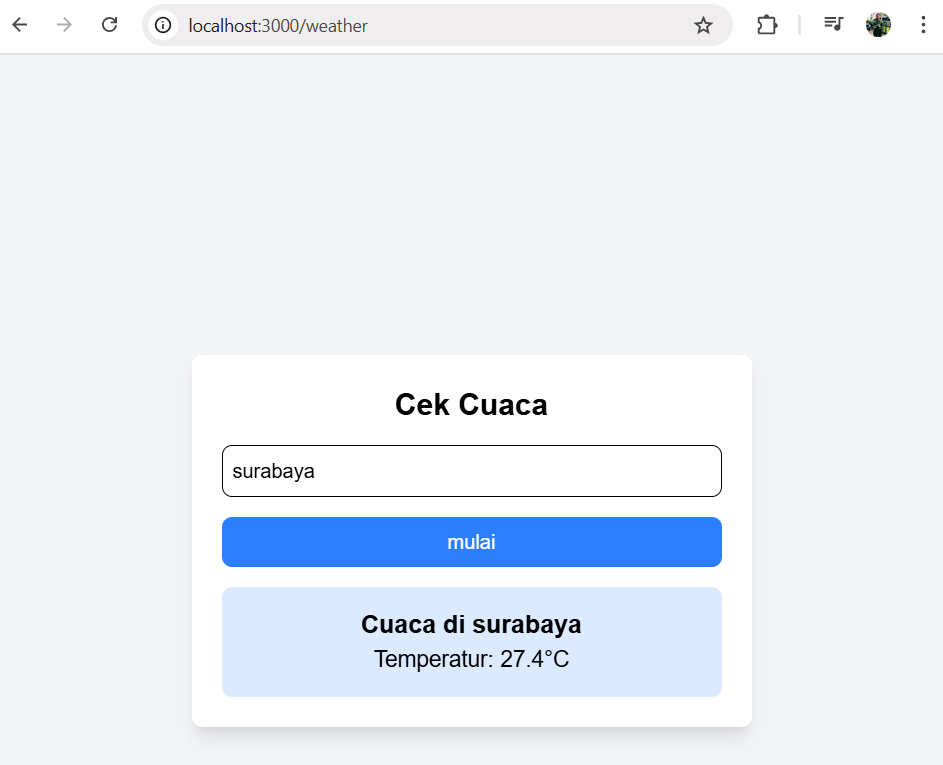